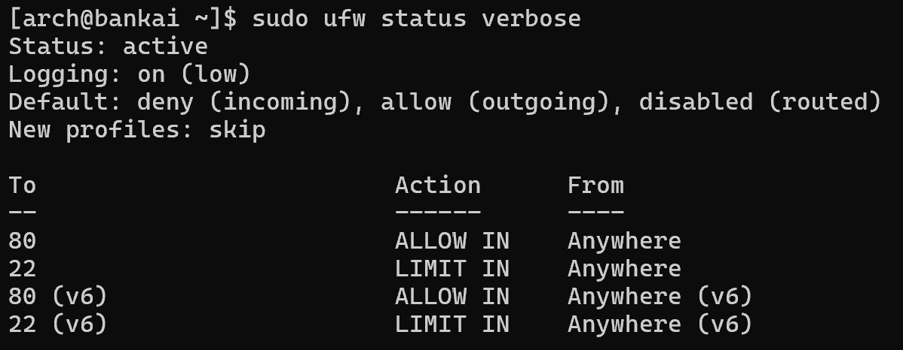
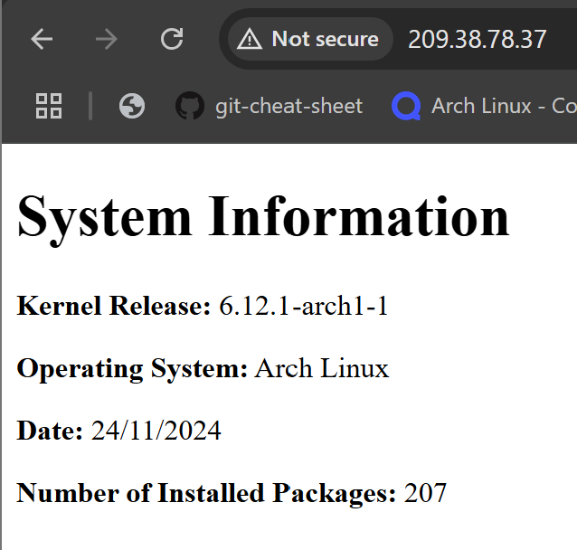

# Assignment3p1
## Introduction
Welcome to my Bash scripting project! This guide will walk you on how to generate a static `index.html` file containing your system's information. The script will be scheduled to run daily at 05:00 using a `systemd` service and timer. The generated HTML file will be served by an nginx web server, with  security provided by a firewall configured using `ufw`.

---
## Prerequisites
To get started, pleas ensure you meet the following requirements:
- **Operating System**: Arch Linux with Bash installed.
- **Permissions**: Root access to run the necessary scripts.
- **Working Directory**: All commands in this guide are executed from the user's home.
- **Installed Packages**: Ensure `nginx` and `ufw` are installed.
---
## Setting up the System User and Directory Structure
1. Run the following command to create a system user with a home directory in `/var/lib/webgen` with a non-login shell:
```bash
sudo useradd -r -d /var/lib/webgen -s /usr/sbin/nologin webgen
```
#### What does this command do?
`useradd`: Command to add a new user to the system.
`-r`:  Creates a system user 
`-d /var/lib/webgen`:  Specifies the home directory for the user as `var/lib/webgen`
`-s /usr/sbin/nologin`: Sets the user's shell to prevent the user from logging into the system interactively
`webgen`: The name of the user being created

>[!NOTE]
>**What is the benefit of creating a system user for this task rather than using a regular user or root?**
>>Using a system user enhances security by limiting privileges and preventing interactive logins, reducing risks compared to using a regular user or root. It isolates processes, simplifies monitoring, and ensures tasks have only the access they need. This approach minimizes potential damage and ensures a more secure, maintainable system.


2. Create the home directory structure
```bash
sudo mkdir /var/lib/webgen/bin /var/lib/webgen/HTML
```

3.  Copy the `generate_index` script into the `/var/lib/webgen/bin` folder
```bash
sudo cp assignment3/2420-as2-start/generate_index /var/lib/webgen/bin
```

4. Give ownership to `webgen` and make `generate_index` executable
```bash
sudo chown -R webgen:webgen /var/lib/webgen
sudo chmod 700 /var/lib/webgen/bin/generate_index
```

---
## Setting up `.timer` and `.service` for `generate_index`
1. Copy the files provided `generate_index.timer` and `generate_index.service` to `/etc/systemd/system`
```bash
sudo cp ~/assignment3/generate_index.{service,timer} /etc/systemd/system
```

2. Reload `systemd` after the changes:
```bash
sudo systemctl daemon-reload
```

3. Enable and start the timer:
```bash
sudo systemctl enable generate_index.timer
sudo systemctl start generate_index.timer
```

4. Verify that `.timer` and `.service` is running successfully:
```bash
# Check when the timer will run next:
systemctl list-timers --all | grep generate_index.timer

# Check if the service ran successfully:
sudo systemctl status generate_index.service

# View logs for service:
journalctl -u generate_index.service

# View logs for timer:
journalctl -u generate_index.timer
```

---
## Setting Up `nginx`
1. Create a directory for the server block:
```bash
sudo mkdir /etc/nginx/sites-available /etc/nginx/sites-enabled
```

2. Copy the file `default.conf` to `/etc/nginx/sites-available`:
```bash
sudo cp ~/assignment3/default.conf /etc/nginx/sites-avilable
```

3. Create a symbolic link:
```bash
ln -s /etc/nginx/sites-available/default.conf /etc/nginx/sites-enabled/default.conf
```

4. Start and enable `nginx`:
```bash
sudo systemctl start nginx
sudo systemctl enable nginx
```

5. Check the status of the `nginx` services and test your `nginx` configuration:
```bash
# Check status and verify if it's running
sudo systemctl status nginx

# Check any errors in the nginx configuration
sudo nginx -t

# Apply any changes you've made to the configuration
sudo systemctl reload nginx
```

>[!NOTE]
> **Why is it important to use a separate server block file instead of modifying the main `nginx.conf` file?**
> > Using a separate server block keeps configurations organized and easy to manage. IT reduces errors, simplifies troubleshooting, and makes backups and scaling easier compared to editing the main `nginx.conf` file.

---
## Setting up `ufw`
1.  Enable and start the `ufw.service`:
```bash
sudo systemctl enable --now ufw.service
```

2. Allow SSH connection and limit the rate to our firewall:
```bash
sudo ufw allow ssh
sudo ufw limit ssh
```

3. Allow http connections:
```bash
sudo ufw allow http
```

4. Once set-up, run the following:
```bash
sudo ufw enable
```

5. Check the status to confirm that everything is working:
```bash
sudo ufw status verbose
```

**Output**:


---
## Check if Web Server is Running
To check if your web server is running, please go to any web browser and enter in `http://please-input-your-ip-address`

**Successful output**:

